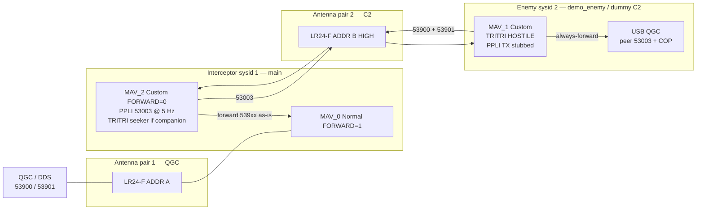

# C-UAS interceptor — MAVLink-M ICD (TRITRI end-to-end)

## Working field setup (14 Aug 2026)

Two MicoAir H743-v2. **Do not flash `demo_enemy` onto the interceptor.** This file is on **`main`** (interceptor) and **`demo_enemy`** (enemy FC).

**Dialect:** `CONFIG_MAVLINK_DIALECT="tritri"` → [`tritri.xml`](src/modules/mavlink/mavlink/message_definitions/v1.0/tritri.xml).

**One COP type:** live TRACK/TARGET is **only** `TRITRI_TRACK` **53900** / `TRITRI_TARGET` **53901** on air, uORB, DDS, and QGC. No expand/collapse to 53000/53010.


| Aircraft    | Git                       | `MAV_SYS_ID` | Role                                 |
| ----------- | ------------------------- | ------------ | ------------------------------------ |
| Interceptor | `main` + **tritri** dialect | **1**        | Hear HOSTILE, forward COP to QGC     |
| Enemy       | `demo_enemy`              | **2**        | Advertise self as HOSTILE (`leseni`); also dummy C2 |


Two **separate** [LR24-F](https://micoair.com/radio_telemetry_lr24f/) pairs (different **ADDR**).

| Pair | Who | UART | Job |
| ---- | --- | ---- | --- |
| **QGC** | Interceptor `MAV_0` ↔ QGC | interceptor `ttyS0` @57600 | Fly interceptor; sees **53900/53901** (same msgids as air) |
| **C2** | Enemy `MAV_1` ↔ interceptor `MAV_2` | enemy `ttyS3`, interceptor `ttyS4` @57600 | Lean COP + PPLI + events |

C2 budget: plan **~2 kB/s** both-way steady (~1.4 kB/s typical with TRITRI + PPLI@5).



### Keep sets

**TRITRI_TRACK (53900):** times, `track_uid[16]`, set_id, id_confidence, ATR×3, origin_sysid/sensor, id_method, pid_status, class/force/STANAG/environment, sidc_context.

**TRITRI_TARGET (53901):** times, `track_uid[16]`, `target_name[16]`, target_id, set_id, flags, lat/lon/alt, vel, cov×6, confidence, class/domain/force, sensor_type, tle_category, restricted_target_flags.

**Not on live COP:** package path/IPs, CEP, PRF, DMPI, land 2525d, parent UID, id_basis[50], Link-16 strings (full 53000/53010 unused on path).

### DDS / uORB

| Direction | Topic | Type |
| --- | --- | --- |
| out | `/fmu/out/mavlink_m_tritri_track` | `MavlinkMTritriTrack` |
| out | `/fmu/out/mavlink_m_tritri_target` | `MavlinkMTritriTarget` |
| in | `/fmu/in/mavlink_m_tritri_track` | `MavlinkMTritriTrack` |
| in | `/fmu/in/mavlink_m_tritri_target_send` | `MavlinkMTritriTarget` |

### Enemy params (`demo_enemy`)

```text
MAV_SYS_ID      2
MAV_1_MODE      1         Custom — C2 on ttyS3
MAV_1_FORWARD   0
```

Custom: **TRITRI_TRACK 1 Hz**, **TRITRI_TARGET 5 Hz**, SYS_STATUS 0.5 Hz, HEARTBEAT, HANDOVER/FIRES/ENGAGEMENT one-shots. Hardcoded `leseni` HOSTILE. **PPLI TX stubbed.**

### Interceptor params (`main`)

```text
MAV_SYS_ID      1
MAV_0_FORWARD   1
MAV_2_MODE      1         Custom — C2
MAV_2_FORWARD   0
```

Custom: HEARTBEAT + **PARTICIPANT_POSITION @ 5 Hz** + companion **TRITRI_TRACK @ 1 Hz** / **TRITRI_TARGET @ 5 Hz** + ACK/BDA. Normal/Onboard also stream **TRITRI_*** @ 20 Hz (not 53000/53010).

`should_always_forward`: 53900/53901/53002/53003/53020/53023/53004/53022 + gimbal.

### Wire IDs

| msgid | Name | On-wire | Demo |
| ---: | --- | ---: | --- |
| 0 | HEARTBEAT | 21 B | both, 1 Hz |
| 1 | SYS_STATUS | ~55 B | enemy Custom 0.5 Hz |
| **53900** | **TRITRI_TRACK** | **~65 B** | enemy→icept 1 Hz; seeker/onboard as configured |
| **53901** | **TRITRI_TARGET** | **~128 B** | enemy→icept 5 Hz |
| **53003** | **PARTICIPANT_POSITION** | **122 B** | icept→C2 @ 5 Hz; enemy TX stubbed |
| 53002 | TARGET_HANDOVER | ~219 B | events |
| 53004 | MAVLINK_M_ACK | — | events |
| 53020 / 53023 / 53022 | FIRES / ENGAGEMENT / BDA | — | events |

### Check

```text
# interceptor
listener mavlink_m_tritri_track     # origin_sysid=2, uid[15]=2, HOSTILE
listener mavlink_m_tritri_target    # name=leseni, target_id=2
mavlink status                      # #2 RX: 53900 ~1 Hz, 53901 ~5 Hz

# enemy (dummy C2)
listener mavlink_m_participant_position   # origin_sysid=1, speed0
mavlink status                            # Custom RX: 53003 ~5 Hz from sysid 1

# Jetson
ros2 topic hz /px4_0/fmu/out/mavlink_m_tritri_track
ros2 topic hz /px4_0/fmu/out/mavlink_m_tritri_target
```

### External flag-day (lockstep)

| Repo | Change |
| --- | --- |
| **px4_msgs** | Add `MavlinkMTritriTrack` / `MavlinkMTritriTarget`; stop using old track/target msgs for live COP |
| **seeker / speedo_c2** | Publish `/fmu/in/mavlink_m_tritri_track` and `/fmu/in/mavlink_m_tritri_target_send` |
| **QGC (custom)** | Tritri dialect; COP UI binds **53900/53901** (not 53000/53010) |

Flash both FCs + Jetson msgs + QGC together — mixed old/new COP will not interoperate.
