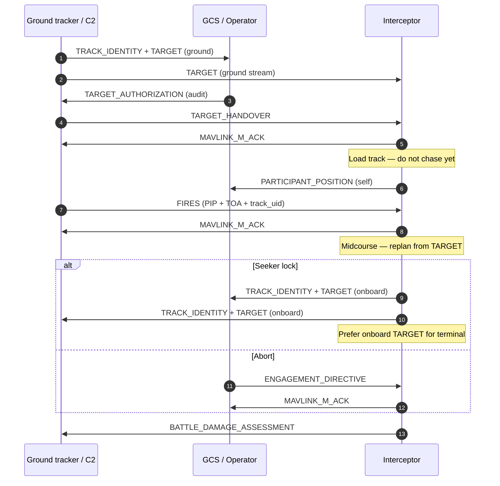

# C-UAS interceptor — MAVLink-M ICD

Ground tracker finds a hostile → `TARGET_HANDOVER` loads the track (armed, gated) →
`FIRES` starts the chase with a predicted intercept point (PIP) → live kinematics on
`TARGET` → onboard seeker publishes its own `TRACK_IDENTITY` + `TARGET`.

| Role | Message |
| ---- | ------- |
| Hostile / track | `TRACK_IDENTITY` + `TARGET` |
| Friendly self | `PARTICIPANT_POSITION` only |
| Assign (no chase) | `TARGET_HANDOVER` |
| Engage | `FIRES` (PIP + TOA + `track_uid`) |
| Guide after engage | `TARGET` stream |
| Abort / retarget | `ENGAGEMENT_DIRECTIVE` |
| ACK / BDA | `MAVLINK_M_ACK`, `BATTLE_DAMAGE_ASSESSMENT` |

## Actors

| Actor | Publishes |
| ----- | --------- |
| Ground tracker / C2 | `TRACK_IDENTITY`, `TARGET`, `TARGET_HANDOVER`, `FIRES`, `ENGAGEMENT_DIRECTIVE` |
| Interceptor | `PARTICIPANT_POSITION` (self), ACK, onboard `TRACK_IDENTITY` + `TARGET`, BDA |
| Operator / GCS | `TARGET_AUTHORIZATION` (audit), may trigger `FIRES` / directive |

## Sequence



## Companion fly logic

1. `HANDOVER` → store `track_uid_G`, filter `TARGET`, hold
2. `FIRES` → midcourse from PIP / `time_impact_usec`
3. Replan from live `TARGET` → PX4 setpoints
4. Seeker lock → publish onboard `TRACK_IDENTITY` + `TARGET`; prefer onboard for terminal
5. Keep `PARTICIPANT_POSITION` as own-ship only

```text
Ground track:   track_uid_G
Onboard track:  track_uid_I  (parent_track_uid = track_uid_G)
Guidance:       ground TARGET until lock → onboard TARGET after
```

## Example fields

**Ground `TRACK_IDENTITY`**

```text
track_uid / origin_sysid / target_class=UAS_MULTIROTOR / target_force=HOSTILE
```

**Ground `TARGET`** — lat/lon/alt, NED vel, cov (PIP + midcourse replan)

**`TARGET_HANDOVER`** — `track_uid_G` + kinematics snapshot; load only, wait for `FIRES`

**`PARTICIPANT_POSITION`** (FC estimator stream)

```text
lat/lon/alt, vx/vy/vz, course=COG, callsign=speed0, origin_sysid=MAV_SYS_ID
stanag_identity=FRIEND, ppli_type=AIR
lat/lon = INT32_MAX if unknown (never fake 0,0); alt/vel/course = NaN if unknown
```


**`FIRES`**

```text
lat/lon/alt = PIP, time_impact_usec = TOA, track_uid, sequence, effector_id
```

After ACK, chase from live `TARGET`; C2 may re-send `FIRES` when PIP changes.

**Onboard lock**

```text
TRACK_IDENTITY: track_uid_I, parent=track_uid_G, origin_sysid=interceptor
TARGET:         seeker lat/lon/alt + vel
```

**`BATTLE_DAMAGE_ASSESSMENT`** — prefer `track_uid_G` for chain continuity

## Message cheat sheet

| Message | Effect |
| ------- | ------ |
| `TRACK_IDENTITY` / `TARGET` (ground) | Hostile on COP; kinematics |
| `TARGET_AUTHORIZATION` | Audit only |
| `TARGET_HANDOVER` | Load track; wait |
| `PARTICIPANT_POSITION` | Blue self |
| `FIRES` | Start chase (PIP) |
| `TRACK_IDENTITY` / `TARGET` (onboard) | Seeker track |
| `ENGAGEMENT_DIRECTIVE` | Abort / retarget |
| `BATTLE_DAMAGE_ASSESSMENT` | Close engagement |

`LOITER_MUNITION_CONTROL` is not used for this high-speed intercept path.

## PX4 wiring (`CONFIG_MAVLINK_DIALECT=military`)

| MAVLink-M | uORB | ROS 2 |
| --------- | ---- | ----- |
| `TRACK_IDENTITY` | `mavlink_m_track_identity` | `MavlinkMTrackIdentity` |
| `TARGET` | `mavlink_m_target` | `MavlinkMTarget` |
| `TARGET_HANDOVER` | `mavlink_m_target_handover` | `MavlinkMTargetHandover` |
| `FIRES` | `mavlink_m_fires` | `MavlinkMFires` |
| `ENGAGEMENT_DIRECTIVE` | `mavlink_m_engagement_directive` | `MavlinkMEngagementDirective` |
| `MAVLINK_M_ACK` | `mavlink_m_ack` | `MavlinkMAck` |
| `BATTLE_DAMAGE_ASSESSMENT` | `mavlink_m_battle_damage_assessment` | `MavlinkMBattleDamageAssessment` |
| `PARTICIPANT_POSITION` | `mavlink_m_participant_position` | `MavlinkMParticipantPosition` |

### Paths

| Direction | Messages |
| --------- | -------- |
| In `/fmu/out/` | peer `TRACK`/`TARGET`/`HANDOVER`/`FIRES`/`DIRECTIVE`, peer PPLI, peer ACK/BDA |
| Out `/fmu/in/` → stream | seeker `TRACK`, `TARGET`/`HANDOVER` via `*_send`, ACK, BDA |
| Out (FC) | own-ship `PARTICIPANT_POSITION` |

Companion must set `origin_sysid` / `ack_sysid` = `vehicle_status.system_id` (`MAV_SYS_ID`).

**TARGET / TARGET_HANDOVER in vs out:** wire payloads have no `origin_sysid`, so peer RX and companion TX use separate uORB topics:

| ROS | uORB | Role |
| --- | ---- | ---- |
| `/fmu/out/mavlink_m_target` | `mavlink_m_target` | Network RX only |
| `/fmu/in/mavlink_m_target_send` | `mavlink_m_target_send` | Companion → TARGET stream |
| `/fmu/out/mavlink_m_target_handover` | `mavlink_m_target_handover` | Network RX only |
| `/fmu/in/mavlink_m_target_handover_send` | `mavlink_m_target_handover_send` | Companion → HANDOVER stream |

`TRACK_IDENTITY` can share one uORB: the stream already TX-filters on payload `origin_sysid == MAV_SYS_ID`.

Default rates (`MAVLINK_MODE_NORMAL` / `ONBOARD`, military dialect only):

```text
PARTICIPANT_POSITION       10 Hz
TRACK_IDENTITY             20 Hz
TARGET                     20 Hz
TARGET_HANDOVER            unlimited (on event)
MAVLINK_M_ACK              unlimited (on event)
BATTLE_DAMAGE_ASSESSMENT   unlimited (on event)
```

Override later with `mavlink stream` or `MAV_CMD_SET_MESSAGE_INTERVAL`.

| Publish | `/fmu/in/mavlink_m_{track_identity,target,target_handover,ack,battle_damage_assessment}` |
| Subscribe | `/fmu/out/mavlink_m_*` (+ `fires`, `engagement_directive`, `participant_position`) |
