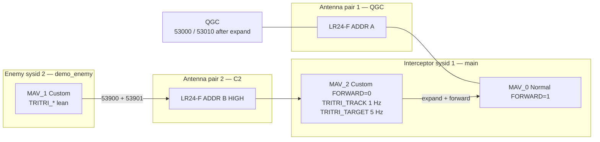
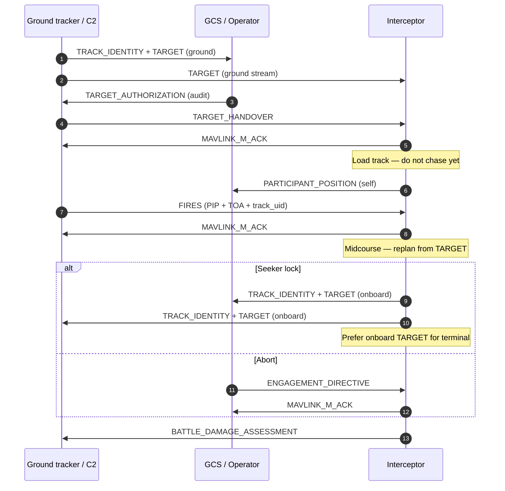

# C-UAS interceptor — MAVLink-M ICD

## Working field setup (14 Aug 2026)

Two MicoAir H743-v2. **Do not flash `demo_enemy` onto the interceptor.** This file is on **`main`** (interceptor) and **`demo_enemy`** (enemy FC).

**Dialect:** `CONFIG_MAVLINK_DIALECT="tritri"` → [`tritri.xml`](src/modules/mavlink/mavlink/message_definitions/v1.0/tritri.xml) includes `military.xml` + private lean msgs.


| Aircraft    | Git                       | `MAV_SYS_ID` | Role                                 |
| ----------- | ------------------------- | ------------ | ------------------------------------ |
| Interceptor | `main` + **tritri** dialect | **1**        | Hear HOSTILE, forward COP to QGC     |
| Enemy       | `demo_enemy`              | **2**        | Advertise self as HOSTILE (`leseni`) |


Two **separate** [LR24-F](https://micoair.com/radio_telemetry_lr24f/) pairs (different **ADDR**). Do not share one pair for both jobs.

| Pair | Who | UART | Job |
| ---- | --- | ---- | --- |
| **QGC** | Interceptor `MAV_0` ↔ QGC only | interceptor `ttyS0` @57600 | Fly the interceptor. Sees **expanded** `TRACK_IDENTITY` **53000** / `TARGET` **53010** (from lean air). |
| **C2** | Enemy `MAV_1` ↔ interceptor `MAV_2` | enemy `ttyS3` @57600, interceptor `ttyS4` @57600 | Lean air: **`TRITRI_TRACK` 53900 @ 1 Hz**, **`TRITRI_TARGET` 53901 @ 5 Hz** + HANDOVER/ACK events |

C2 pair: **MODE=DUPLEX**, **RATE=HIGH** (8 KB/s), UART **57600**. Half-duplex — lean TRITRI_* keeps ~1.5 kB/s both-way.



On RX, FC **expands** TRITRI_* → `mavlink_m_track_identity` / `mavlink_m_target` (Jetson/DDS unchanged). Forward to QGC re-encodes as **53000/53010**.

### Lean message keep sets

**TRITRI_TRACK (53900):** times, `track_uid[16]`, set_id, id_confidence, ATR×3, origin_sysid/sensor, id_method, pid_status, class/force/STANAG/environment, sidc_context.

**TRITRI_TARGET (53901):** times, `track_uid[16]`, `target_name[16]`, target_id, set_id, flags, lat/lon/alt, vel, cov×6, confidence, class/domain/force, sensor_type, tle_category, restricted_target_flags.

**Cut on air:** package path/IPs, CEP, PRF, DMPI, land 2525d, parent UID, id_basis[50], Link-16 external track strings.


### Enemy params (`demo_enemy`)

```text
MAV_SYS_ID      2
MAV_0_MODE      0         Normal — local telem, not interceptor QGC
MAV_1_MODE      1         Custom — C2 on ttyS3
MAV_1_FORWARD   0         required — see "QGC on enemy USB" below
MAV_1_CONFIG    TELEM 2   /dev/ttyS3 @57600
```

Custom: **TRITRI_TRACK 1 Hz**, **TRITRI_TARGET 5 Hz**, HEARTBEAT 1 Hz. (Port hardcoded `leseni` generator to TRITRI streams if still on full 53000/53010.)

**QGC on enemy USB:** USB always has `FORWARD` on. If `MAV_1_FORWARD=1`, QGC sees interceptor as vehicle 1 and `SET_MESSAGE_INTERVAL` opens a full GCS session on the LoRa hop. Interceptor C2 then shows `sysid 254`; enemy Custom UART `FIONSPACE` stays 0; HANDOVER never goes out. After `MAV_1_FORWARD=0` + reboot: C2 RX is interceptor HB only (~87 B/s), USB 20 kB/s stays on `ttyACM0`.

### Interceptor params (`main`)

```text
MAV_SYS_ID      1
MAV_0_MODE      0         Normal — QGC antenna ttyS0
MAV_0_FORWARD   1         QGC pair only
MAV_2_MODE      1         Custom — C2 antenna ttyS4
MAV_2_FORWARD   0         never forward QGC onto C2
```

Custom TX: HEARTBEAT + companion seeker **TRITRI_TRACK @ 1 Hz** / **TRITRI_TARGET @ 5 Hz** (own `origin_sysid` / `mavlink_m_target_send`) + ACK/BDA on event. Onboard still does full TRACK/TARGET @ 20 Hz to the Jetson.

`MAV_2_FORWARD=0` still blocks QGC **onto** C2. COP frames that **arrive** on C2 are always forwarded to instances with FORWARD on (`should_always_forward`: 53000/53010/53002/53020/53023/53004/53022 + gimbal). QGC Inspector shows enemy TRACK/TARGET without `mavlink stream -s MAVLINK_M_ACK`. Do not set `MAV_2_FORWARD=1`.

### Wire message IDs (`mavlink status` → `msgid`)

Military dialect. Common IDs stay in the low range; COP is 53000+.

| msgid | MAVLink name | On-wire | This demo |
| ----- | ------------ | ------- | --------- |
| 0 | HEARTBEAT | 21 B | both, 1 Hz |
| 1 | SYS_STATUS | 55 B | enemy Custom 0.5 Hz |
| 33 | GLOBAL_POSITION_INT | 40 B | not on Custom |
| 42 | MISSION_CURRENT | — | PX4 leak, ignore |
| 410 | EVENT | — | **off** on enemy Custom |
| 411 | CURRENT_EVENT_SEQUENCE | — | **off** on enemy Custom |
| **53000** | **TRACK_IDENTITY** | **153 B** | enemy → interceptor, 5 Hz |
| 53001 | TARGET_CUE | — | unused here |
| 53002 | TARGET_HANDOVER | ~219 B | `mavlink cop handover` (proven RX on Jetson) |
| 53003 | PARTICIPANT_POSITION | 122 B | interceptor only (blue PPLI). Enemy stubbed. |
| 53004 | MAVLINK_M_ACK | — | ACK (event) |
| **53010** | **TARGET** | **257 B** | enemy → interceptor, 5 Hz |
| 53011 | TARGET_SET_COORD | — | unused here |
| 53012 | TARGET_BOX_COORD | — | unused here |
| 53013 | TARGET_AUTHORIZATION | — | audit |
| 53020 | FIRES | — | start chase |
| 53021 | SPLASH_CORRECTION | — | unused here |
| 53022 | BATTLE_DAMAGE_ASSESSMENT | — | close engagement |
| 53023 | ENGAGEMENT_DIRECTIVE | — | `abort`/`checkfire`/`resume` (0/1/2) |

ROS does not use these numbers. Same payloads:

| msgid | uORB | ROS 2 |
| ----- | ---- | ----- |
| 53000 | `mavlink_m_track_identity` | `/px4_0/fmu/out/mavlink_m_track_identity` |
| 53010 | `mavlink_m_target` | `/px4_0/fmu/out/mavlink_m_target` |
| 53003 | `mavlink_m_participant_position` | `/px4_0/fmu/out/mavlink_m_participant_position` (interceptor self) |

### What broke it / what fixed it


| Failure | Fix |
| ------- | --- |
| Enemy Normal firehose on C2 | `MAV_1_MODE=1` Custom |
| Interceptor `#2` Normal + FORWARD, ~2 kB/s TX | `MAV_2_MODE=1`, `MAV_2_FORWARD=0` |
| EVENT 410 at ~61 Hz | Custom skips events (enemy build) |
| Full vehicle 1 on enemy USB / C2 `sysid 254` | `MAV_1_FORWARD=0` + reboot |
| `send_start` drops 219 B (`FIONSPACE=0` while TX is 1.7 kB/s) | queue one-shot; mavlink thread `write()`s |
| NSH `write(uart_fd)` errno 9 | NuttX fds are per-task — do not write from `mavlink cop` |
| Companion `valid_until` expired | send `valid_until_usec=0` (ROS UNIX µs ≠ FC hrt) |
| Companion `lat lon INT32_MAX` | expected without GPS; NACK `Failed`, not a radio miss |
| QGC on interceptor never sees 53000/53010 | `should_always_forward` on C2 RX (`MAV_2_FORWARD` stays 0) |
| Companion ACK never left C2 | Custom streams ACK/BDA (was HB-only) |
| Enemy never saw seeker TRACK/TARGET | Custom TRACK/TARGET 5 Hz (own-sysid / `*_send`) |


### Check

```text
# interceptor nsh
listener mavlink_m_track_identity    # uid[15]=2, HOSTILE/FOE, origin_sysid=2
listener mavlink_m_target            # name=leseni, target_id=2
mavlink status                       # inst #2: msgid 53000 and 53010 ~5 Hz

# Jetson
ros2 topic hz /px4_0/fmu/out/mavlink_m_track_identity
ros2 topic hz /px4_0/fmu/out/mavlink_m_target
```

ROS `hz` can be ~2 Hz with holes (uXRCE + half-duplex). Trust interceptor `mavlink status` msgid rates for the air link. Unknown GPS: TARGET lat/lon=`INT32_MAX`, alt/vel=NaN.

### Full workflow test (enemy nsh)

`demo_enemy` only. One-shots are queued onto Custom; TRACK/TARGET pause while waiting for ACK.

Companion (`speedo_c2_example` on speed0-1): `own_sysid=1`, **`c2_sysid=200`**. ACK `origin_sysid` is 200, not 2. It NACKs HANDOVER if lat/lon are `INT32_MAX` or alt is NaN; `Accepted` then **arms the interceptor**.

On current `main`, Custom already streams ACK/BDA. No `mavlink stream -s MAVLINK_M_ACK` needed after flash.

```text
# enemy (after MAV_1_FORWARD=0)
mavlink cop handover          # 53002 — proven: Jetson onHandover(), then geo NACK
mavlink cop fires             # 53020
mavlink cop checkfire         # 53023 CHECK_FIRE(1) — companion NACKs if no intercept
mavlink cop resume            # 53023 RESUME(2) — companion NACKs if not in check-fire
mavlink cop abort             # 53023 ABORT(0)
mavlink cop workflow          # handover ACK, then fires ACK

# interceptor
listener mavlink_m_target_handover
listener mavlink_m_fires
listener mavlink_m_engagement_directive

# Jetson log
#   TARGET_HANDOVER (target_set_id=0 valid_until=0 …)
#   rejected — lat lon INT32_MAX   ← bench, no GPS
```

Same `track_uid[15]=MAV_SYS_ID` (2) and `sequence` as FIRES so abort/resume match. Kinematics from estimator, or INT32_MAX/NaN if no GPS. Do not put a dummy PIP unless props are off — companion will arm.

`ENGAGEMENT_DIRECTIVE.directive` must match `speedo_c2_example` (`executor.hpp`). The old cop fallback sent ABORT=1, which is CHECK_FIRE.

| `mavlink cop` | `directive` | Companion |
| ------------- | ----------- | --------- |
| `abort` | **0** ABORT | always `Accepted` (`ROS2: ABORT`) |
| `checkfire` | **1** CHECK_FIRE | `Rejected` / `no active interception` unless FIRES/Kill |
| `resume` | **2** RESUME | `Rejected` / `not in check-fire` unless after check-fire |
| *(none yet)* | **3** RETARGET | needs valid lat/lon/alt |

Bench with no chase: `abort` ACKs; `resume` / `checkfire` NACK for the reason above — that still means 53023 landed.

---

Ground tracker finds a hostile → `TARGET_HANDOVER` loads the track (armed, gated) →
`FIRES` starts the chase with a predicted intercept point (PIP) → live kinematics on
`TARGET` → onboard seeker publishes its own `TRACK_IDENTITY` + `TARGET`.


| Role               | Message                                     |
| ------------------ | ------------------------------------------- |
| Hostile / track    | `TRACK_IDENTITY` + `TARGET`                 |
| Friendly self      | `PARTICIPANT_POSITION` only                 |
| Assign (no chase)  | `TARGET_HANDOVER`                           |
| Engage             | `FIRES` (PIP + TOA + `track_uid`)           |
| Guide after engage | `TARGET` stream                             |
| Abort / retarget   | `ENGAGEMENT_DIRECTIVE`                      |
| ACK / BDA          | `MAVLINK_M_ACK`, `BATTLE_DAMAGE_ASSESSMENT` |


## Actors


| Actor                           | Publishes                                                                      |
| ------------------------------- | ------------------------------------------------------------------------------ |
| Ground tracker / C2             | `TRACK_IDENTITY`, `TARGET`, `TARGET_HANDOVER`, `FIRES`, `ENGAGEMENT_DIRECTIVE` |
| Enemy surrogate (this FC build) | `TRACK_IDENTITY` + `TARGET` from estimator (no PPLI)                           |
| Interceptor                     | `PARTICIPANT_POSITION` (self), ACK, onboard `TRACK_IDENTITY` + `TARGET`, BDA   |
| Operator / GCS                  | `TARGET_AUTHORIZATION` (audit), may trigger `FIRES` / directive                |


## Sequence




## Companion fly logic

1. `HANDOVER` → store `track_uid_G`, filter `TARGET`, hold
2. `FIRES` → midcourse from PIP / `time_impact_usec`
3. Replan from live `TARGET` → PX4 setpoints
4. Seeker lock → publish onboard `TRACK_IDENTITY` + `TARGET`; prefer onboard for terminal
5. Keep `PARTICIPANT_POSITION` as own-ship only

```text
Ground track:   track_uid_G
Onboard track:  track_uid_I  (parent_track_uid = track_uid_G)
Guidance:       ground TARGET until lock → onboard TARGET after
```

## Example fields

**Ground `TRACK_IDENTITY`**

```text
track_uid / origin_sysid / target_class=UAS_MULTIROTOR / target_force=HOSTILE
```

**Ground `TARGET`** — lat/lon/alt, NED vel, cov (PIP + midcourse replan)

`**TARGET_HANDOVER**` — `track_uid_G` + kinematics snapshot; load only, wait for `FIRES`

**Enemy surrogate FC (this build, hardcoded)** — no companion needed:

```text
PPLI:           disabled
TRACK_IDENTITY: track_uid[15]=MAV_SYS_ID, HOSTILE, FOE, UAS_MULTIROTOR, AIR
TARGET:         own lat/lon/alt + NED vel, target_id=MAV_SYS_ID, name=leseni
                lat/lon=INT32_MAX if unknown; alt/vel/cov/CEP=NaN if unknown
```

Do not flash this tree to the interceptor without reverting those streams.

`**PARTICIPANT_POSITION**` (interceptor / blue FC only — disabled on this enemy build)

```text
lat/lon/alt, vx/vy/vz, course=COG, callsign=speed0, origin_sysid=MAV_SYS_ID
stanag_identity=FRIEND, ppli_type=AIR
lat/lon = INT32_MAX if unknown (never fake 0,0); alt/vel/course = NaN if unknown
```

`**FIRES**`

```text
lat/lon/alt = PIP, time_impact_usec = TOA, track_uid, sequence, effector_id
```

After ACK, chase from live `TARGET`; C2 may re-send `FIRES` when PIP changes.

**Onboard lock**

```text
TRACK_IDENTITY: track_uid_I, parent=track_uid_G, origin_sysid=interceptor
TARGET:         seeker lat/lon/alt + vel
```

`**BATTLE_DAMAGE_ASSESSMENT**` — prefer `track_uid_G` for chain continuity

## Message cheat sheet


| Message                               | Effect                     |
| ------------------------------------- | -------------------------- |
| `TRACK_IDENTITY` / `TARGET` (ground)  | Hostile on COP; kinematics |
| `TARGET_AUTHORIZATION`                | Audit only                 |
| `TARGET_HANDOVER`                     | Load track; wait           |
| `PARTICIPANT_POSITION`                | Blue self                  |
| `FIRES`                               | Start chase (PIP)          |
| `TRACK_IDENTITY` / `TARGET` (onboard) | Seeker track               |
| `ENGAGEMENT_DIRECTIVE`                | Abort(0) / check-fire(1) / resume(2) / retarget(3) |
| `BATTLE_DAMAGE_ASSESSMENT`            | Close engagement           |


`LOITER_MUNITION_CONTROL` is not used for this high-speed intercept path.

## PX4 wiring (`CONFIG_MAVLINK_DIALECT=military`)


| msgid | MAVLink-M | uORB | ROS 2 |
| ----- | --------- | ---- | ----- |
| 53000 | `TRACK_IDENTITY` | `mavlink_m_track_identity` | `MavlinkMTrackIdentity` |
| 53010 | `TARGET` | `mavlink_m_target` | `MavlinkMTarget` |
| 53002 | `TARGET_HANDOVER` | `mavlink_m_target_handover` | `MavlinkMTargetHandover` |
| 53020 | `FIRES` | `mavlink_m_fires` | `MavlinkMFires` |
| 53023 | `ENGAGEMENT_DIRECTIVE` | `mavlink_m_engagement_directive` | `MavlinkMEngagementDirective` |
| 53004 | `MAVLINK_M_ACK` | `mavlink_m_ack` | `MavlinkMAck` |
| 53022 | `BATTLE_DAMAGE_ASSESSMENT` | `mavlink_m_battle_damage_assessment` | `MavlinkMBattleDamageAssessment` |
| 53003 | `PARTICIPANT_POSITION` | `mavlink_m_participant_position` | `MavlinkMParticipantPosition` |


### Paths


| Direction                  | Messages                                                                      |
| -------------------------- | ----------------------------------------------------------------------------- |
| In `/fmu/out/`             | peer `TRACK`/`TARGET`/`HANDOVER`/`FIRES`/`DIRECTIVE`, peer PPLI, peer ACK/BDA |
| Out `/fmu/in/` → stream    | seeker `TRACK`, `TARGET`/`HANDOVER` via `*_send`, ACK, BDA (interceptor)      |
| Out (FC, this enemy build) | own-ship `TRACK_IDENTITY` + `TARGET` (PPLI off)                               |
| Out (FC, interceptor)      | own-ship `PARTICIPANT_POSITION`                                               |


Companion must set `origin_sysid` / `ack_sysid` = `vehicle_status.system_id` (`MAV_SYS_ID`).

**TARGET / TARGET_HANDOVER in vs out:** wire payloads have no `origin_sysid`, so peer RX and companion TX use separate uORB topics:


| ROS                                      | uORB                             | Role                        |
| ---------------------------------------- | -------------------------------- | --------------------------- |
| `/fmu/out/mavlink_m_target`              | `mavlink_m_target`               | Network RX only             |
| `/fmu/in/mavlink_m_target_send`          | `mavlink_m_target_send`          | Companion → TARGET stream   |
| `/fmu/out/mavlink_m_target_handover`     | `mavlink_m_target_handover`      | Network RX only             |
| `/fmu/in/mavlink_m_target_handover_send` | `mavlink_m_target_handover_send` | Companion → HANDOVER stream |


`TRACK_IDENTITY` can share one uORB: the stream already TX-filters on payload `origin_sysid == MAV_SYS_ID`.

Default rates (`MAVLINK_MODE_NORMAL` / `ONBOARD`, military dialect only):

```text
PARTICIPANT_POSITION       10 Hz
TRACK_IDENTITY             20 Hz
TARGET                     20 Hz
TARGET_HANDOVER            unlimited (on event)
MAVLINK_M_ACK              unlimited (on event)
BATTLE_DAMAGE_ASSESSMENT   unlimited (on event)
```

Override later with `mavlink stream` or `MAV_CMD_SET_MESSAGE_INTERVAL`.

| Publish | `/fmu/in/mavlink_m_{track_identity,target,target_handover,ack,battle_damage_assessment}` |
| Subscribe | `/fmu/out/mavlink_m_*` (+ `fires`, `engagement_directive`, `participant_position`) |
